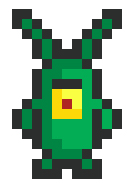
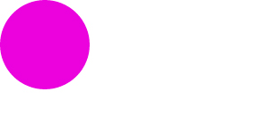
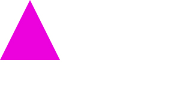
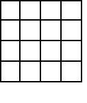
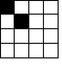
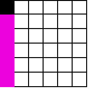
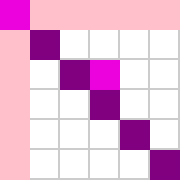
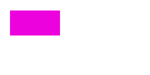
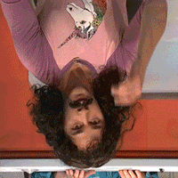

# Da Vinci CSS


> Creating shapes and drawings with CSS.

#### Pixel Art demo



Sheldon J. Plankton -
[View demo](http://afonsopacifer.github.io/da-vinci-css/)

## Summary
- [Why?](#why)
- [How to install?](#how-to-install)
- [Usage](#usage)
  - [Basic shapes](#basic-shapes)
    - [rectangle](#rectangle)
    - [circle](#circle)
    - [oval](#oval)
    - [triangle](#triangle)
  - [Pixel Art](#pixel-art)
    - [markup](#markup)
    - [grid](#grid)
    - [origin](#origin)
    - [pixels](#pixels)
    - [line](#line)
    - [lineX](#linex)
    - [lineY](#liney)
  - [Images](#images)
    - [img](#img)
  - [Edit](#edit)
    - [position](#position)
    - [flip](#flip)
    - [clone](#clone)
    - [opacity](#)
    - [shadow](#)
- [Versioning](#versioning)
- [Contributing](#contributing)
- [History](#history)
- [License](#license)

## <a name="why"></a> Why?

Because it's fun.

## <a name="how-to-install"></a> How to install?

> **Note:** To use the framework, you'll need to compile your style with the Stylus preprocessor using NodeJS, for more information see [NodeJS](https://nodejs.org/en/) and [Stylus](http://stylus-lang.com/).

**Import** the library.

```
@import "da-vinci"
```

**Done** ;)

## Usage

### Basic shapes

#### rectangle

```css
.element
  rect(100px, 50px, #eb02dd) /* width, height, color (default #eb02dd) */
```


#### circle

```css
.element
  circ(50px, #eb02dd) /* radius, color (default = #eb02dd) */
```



#### oval

```css
.element
  oval(100px, 50px, #eb02dd) /* width, height, color (default = #eb02dd) */
```


#### triangle

```css
.element
  tri(100px, 50px, 50px, #eb02dd) /* top, right, left (default = #eb02dd) */
```



### Pixel art

#### markup

```html
<div class="canvas">
  <div class="art"></div>
</div>
```

#### grid

```css
.canvas {
  grid(30px, 4, #000) /* cell size, grid size (default = 4), stroke color (default = #000) */
}
```



#### origin

```css
.art {
  origin(1, 1, 30px, #000) /* row, col, displacement, color (default = #000) */
}
```


#### pixels

```css
.art {
  origin(1, 1, 30px, #000)
  box-shadow: pixel(2, 2, 30px, #000); /* row, col, displacement, color (default = #000) */
}
```

> **Tip:** Create variables and use p( ) > pixel( ).

```css
.art {
  a = 30px
  origin(1, 1, a)
  box-shadow: p(2, 2, a);
}
```



#### line

```css
.art {
  a = 30px
  origin(1, 1, a)
  box-shadow: line(2..6, a, #eb02dd); /* start..end, displacement, color (default = #000) */
}
```


#### lineX

```css
.art {
  a = 30px
  origin(1, 1, a)
  box-shadow: lineX(2..6, a, #eb02dd); /* start..end, displacement, color (default = #000) */
}
```


#### lineY

```css
.art {
  a = 30px
  origin(1, 1, a)
  box-shadow: lineY(2..6, a, #eb02dd); /* start..end, displacement, color (default = #000) */
}
```



**Working all together**

```css
.canvas {
  grid(30px, 6, #ccc)
}

.art {
  a = 30px
  origin(1, 1, a, #eb02dd)
  box-shadow:
    pixel(3, 4, a, #eb02dd),
    line(2..6, a, purple),
    lineY(2..6, a, pink),
    lineX(2..6, a, pink);
}
```



### Images

#### img

```css
.picture
  img("magic.gif", 200px, 200px) /* url, width, height */
```


#### magicWand

```css
.picture
  img("unicorn.gif", 200px, 200px)
  magicWand()
```

### Edit

#### position

```css
.element
  rect(100px, 50px, #eb02dd)
  pos(10px, 10px, 1) /* x, y, layer(default = 1) */
```



#### flip (vertical)

```css
.element
  img("magic.gif", 200px, 200px)
  flip(vertical) /* vertical or horizontal (default = horizontal) */
```



#### flip (horizontal)

```css
.element
  img("magic.gif", 200px, 200px)
  flip(horizontal) /* vertical or horizontal (default = horizontal) */
```


#### clone

```css
.element
  rect(100px, 100px, #eb02dd)
  clone(110px, 0, #ccc) /* x, y, color (default = #eb02dd) */
```


#### opacity

```css
.picture
  img("unicorn.png", 200px, 200px)
  opacity(50%)
```

#### shadow

```css
.picture
  img("unicorn.png", 200px, 200px)
  shadow(10px, 10px, 5px, #000) /*X, Y, dissipation, color (default = #000) */
```

## Versioning

To keep better organization of releases we follow the [Semantic Versioning 2.0.0](http://semver.org/) guidelines.

## Contributing
Find on our [roadmap](https://github.com/afonsopacifer/da-vinci-css/issues/1) the next steps of the project ;)
<br>
Want to contribute? [Follow these recommendations](https://github.com/afonsopacifer/da-vinci-css/blob/master/CONTRIBUTING.md).

## History
See [Releases](https://github.com/afonsopacifer/da-vinci-css/releases) for detailed changelog.

## License
[MIT License](https://github.com/afonsopacifer/da-vinci-css/blob/master/LICENSE.md) © [Afonso Pacifer](http://afonsopacifer.com/)
